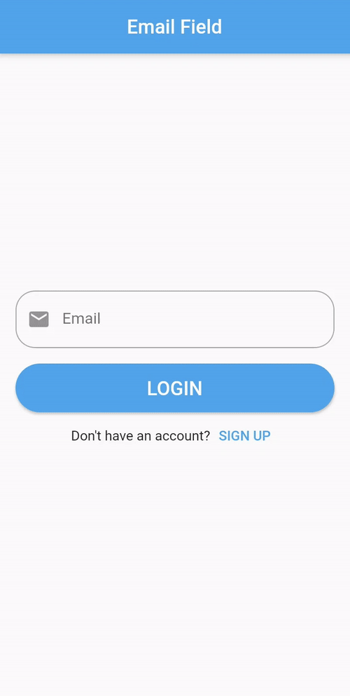

# Dart-Email-Validator
A simple (but correct) Dart class for validating email addresses without using RegEx. Can also be used to validate emails within Flutter apps (see Flutter email validation).  Installation  Dart requires the latest version of Dart. You can download the latest and greatest here.  1. Depend on it  Add this to your package's pubspec.yaml file:  dependencies:     email_validator: '^1.0.6' 2. Install it You can install packages from the command line:  $ pub get .. Alternatively, your editor might support pub. Check the docs for your editor to learn more.  3. Import it Now in your Dart code, you can use:  import 'package:email_validator/email_validator.dart'; Usage  Read the unit tests under test, or see code example below:  void main() {      var email = "fredrik@gmail.com"; assert(EmailValidator.validate(email)); } Tips  You can also use this repo as a template for creating Dart packages, just clone the repo and start hacking :)

Use Forms and TextFormFields for Email Validation in Flutter. Also, learn how to autofill email fields.

### ✌&ensp;Preview

|              App Preview             |             Course Preview           |
| :----------------------------------: | :----------------------------------: |
|  |  |
